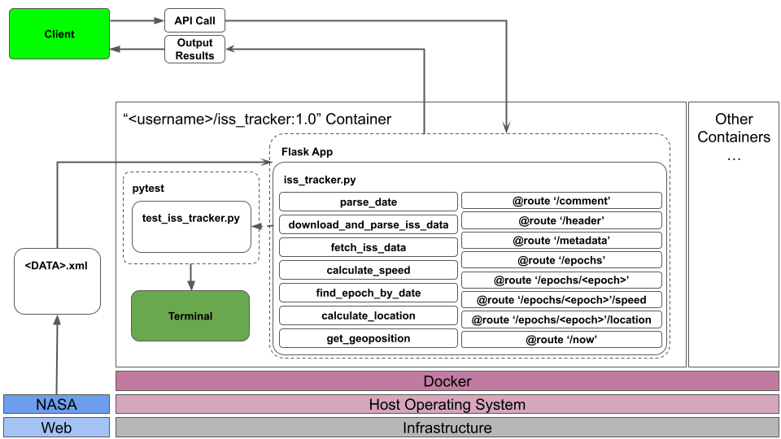

# ISS Trajectory API

## Overview
This project analyzes the International Space Station's (ISS) trajectory data. It includes scripts for downloading and parsing data, and exposes this functionality to the end user using Flask API's.

## Contents
- `iss_tracker.py`: The main script for downloading, parsing, and analyzing the ISS trajectory data as well as running the Flask server.
- `test_iss_tracker.py`: Unit tests for iss_tracker.py.
- `run_app.sh`: Script to run the main application and start the Flask server.
- `run_tests.sh`: Script to execute the unit tests.
- `diagram.png`: Diagram illustrating the program architecture.
- `Dockerfile`: Defines the Docker container setup.

## Getting Started
### Prerequisites
- Docker installed on host machine
- Internet connection

### Data Source
- The ISS trajectory data is sourced from NASA's Public Data: [ISS OEM Data](https://nasa-public-data.s3.amazonaws.com/iss-coords/current/ISS_OEM/ISS.OEM_J2K_EPH.xml).
- This XML file contains detailed state vectors of the ISS over a given period.

### Building the Docker Image
- Navigate to the directory containing the Dockerfile.
- Build the Docker image with the command: `docker build -t <username>/iss_tracker:1.0 .`
    - Don’t forget to replace ‘username’ with your Docker Hub username.

### Running the Containerized App
- To start the app within the Docker container run the following command: `docker run -p 5000:5000 --rm <username>/iss_tracker:1.0`

### Using the App
To interact with the Flask API, use curl commands from your terminal. Example commands include:
- `curl 127.0.0.1:5000/epochs` to retrieve the entire data set.
- `curl 127.0.0.1:5000/epochs?limit=<int>&offset=<int>` to get the ISS state vectors within a certain range.
    - Example Usage: `curl 127.0.0.1:5000/epochs?limit=10&offset=5`
- `curl 127.0.0.1:5000/epochs/<yyyy-MM-ddTHH:mm:ss.0Z>` to retrieve the ISS state vectors for a specific Epoch.
    - Example Usage: `curl 127.0.0.1:5000/epochs/2024-02-22T12:00:00.0Z`
- `curl 127.0.0.1:5000/epochs/<yyyy-MM-ddTHH:mm:ss.0Z>/speed` to retrieve the ISS state vectors for a specific Epoch.
    - Example Usage: `curl 127.0.0.1:5000/epochs/2024-02-22T12:00:00.0Z/speed`
- `curl 127.0.0.1:5000/now` to retrieve the ISS state vectors and instantaneous speed for the Epoch nearest in time.

### Running the Containerized Unit Tests
- To run the unit tests within the Docker container, run the following command: `docker run -p 5000:5000 --rm <username>/iss_tracker:1.0 run_tests.sh`

## Interpretation of Results
The output from `iss_tracker.py` includes:
- `/epochs` Endpoint (Full Data Set): This returns a set of state vectors for the ISS over all epochs within the data set. Each entry includes position coordinates (X, Y, Z) and velocity components (X_DOT, Y_DOT, Z_DOT). This data is useful for understanding the orbital path of the ISS over a period.
- `/epochs?limit=<int>&offset=<int>` (Filtered Data Set): Similar to the /epochs endpoint but allows for pagination. This is helpful when you need a specific subset of the data.
- `/epochs/<yyyy-MM-ddTHH:mm:ss.0Z>` (Specific Epoch Data): Retrieves the ISS state vectors for a specified epoch. This helpful to deal with a smaller volume of data.
- `/epochs/<yyyy-MM-ddTHH:mm:ss.0Z>/speed` (Speed at a Specific Epoch): Returns the instantaneous speed of the ISS at a specific epoch, calculated from the velocity components. This can be used to understand the dynamics of the ISS's orbit at particular moments.
- `/now` (Current Epoch Data): Provides the ISS's current or most recent state vectors and instantaneous speed. This important for monitoring the current location and trajectory of the ISS.

## Software Architecture Diagram
- The software architecture diagram visualizes the Dockerized environment of the homework05 Flask app. Within the Docker container, the Flask App is depicted with `iss_tracker.py` running within. The individual functions and routes are highlighted (denoted by bubbles) within `iss_tracker.py`. The diagram also illustrates the unit tests managed by pytest and the flow of data from the web as well as between the client and Flask App.
